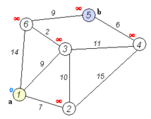

#戴克斯特拉算法（英语：Dijkstra's algorithm）
***
戴克斯特拉算法（英语：Dijkstra's algorithm）是由荷兰计算机科学家艾兹赫尔·戴克斯特拉提出。迪科斯彻算法使用了广度优先搜索解决非负权有向图的单源最短路径问题，算法最终得到一个最短路径树。该算法常用于路由算法或者作为其他图算法的一个子模块。举例来说，如果图中的顶点表示城市，而边上的权重表示城市间开车行经的距离，该算法可以用来找到两个城市之间的最短路径。

该算法的输入包含了一个有权重的有向图 G，以及G中的一个来源顶点 S。我们以 V 表示 G 中所有顶点的集合。每一个图中的边，都是两个顶点所形成的有序元素对。(u, v) 表示从顶点 u 到 v 有路径相连。我们以 E 表示G中所有边的集合，而边的权重则由权重函数 w: E → [0, ∞] 定义。因此，w(u, v) 就是从顶点 u 到顶点 v 的非负权重（weight）。边的权重可以想像成两个顶点之间的距离。任两点间路径的权重，就是该路径上所有边的权重总和。已知有 V 中有顶点 s 及 t，Dijkstra 算法可以找到 s 到 t 的最低权重路径(例如，最短路径)。这个算法也可以在一个图中，找到从一个顶点 s 到任何其他顶点的最短路径。

最初的戴克斯特拉算法不采用最小优先级队列，时间复杂度是O(|V|^2)(其中|V|为图的顶点个数)。通过斐波那契堆实现的迪科斯彻算法时间复杂度是O(|E|+|V|\log|V|) (其中|E|是边数) （Fredman & Tarjan 1984）。对于不含负权的有向图，这是目前已知的最快的单源最短路径算法。  
  
[wikipedia](https://zh.wikipedia.org/wiki/%E6%88%B4%E5%85%8B%E6%96%AF%E7%89%B9%E6%8B%89%E7%AE%97%E6%B3%95)
